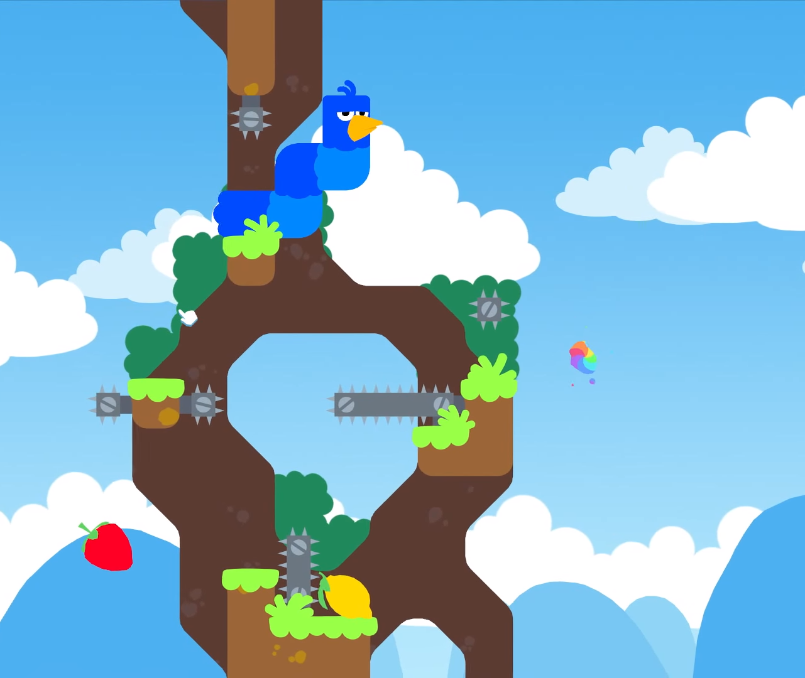
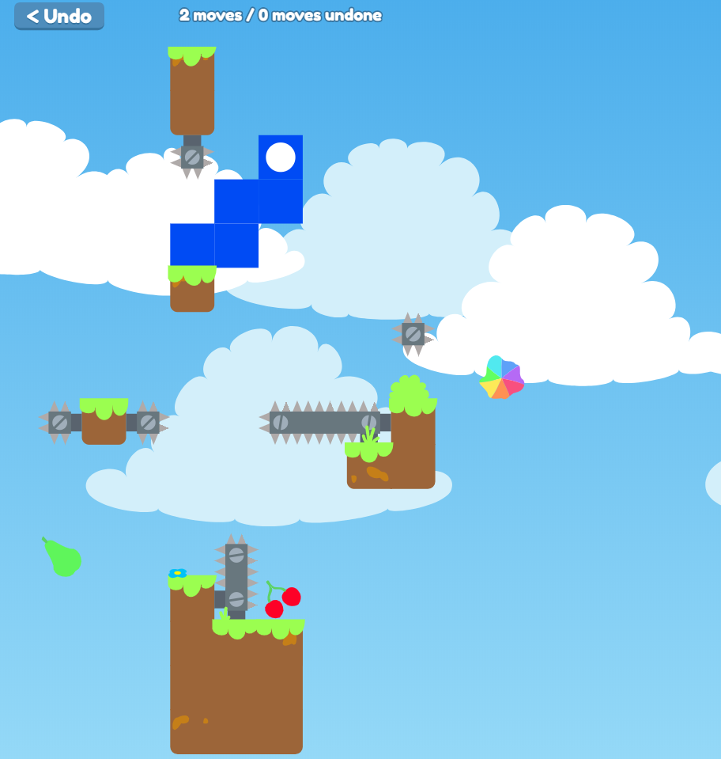

# Snakebird

This is an implementation of Snakebird in JavaScript. The original
game was published by [Noumenon Games](http://noumenongames.com/)
and can be bought...
* ...on [Steam](https://store.steampowered.com/app/357300/Snakebird/)
* ...on [Google Play Store](https://play.google.com/store/apps/details?id=com.NoumenonGames.SnakeBird_Touch)
* ...on [Apple App Store](https://itunes.apple.com/de/app/snakebird/id1087075743?mt=8)

The game is mostly finished. Some small changes could still be made from time to time.

You can currently play all the original levels at
[https://m-ff-m.github.io/snakebird/](https://m-ff-m.github.io/snakebird/) or clone the
repository and open index.html. In addition, all the
[Snakefall](https://github.com/thejoshwolfe/snakefall) levels available at
[github.com/thejoshwolfe/snakefall/wiki](https://github.com/thejoshwolfe/snakefall/wiki)
are also playable, next to some levels with special features: gravity changes
its direction in clockwise order when a snake eats a fruit in the
"Which way is up?" levels and snakes that leave the board enter it again
on the opposite side in "Endless Space" levels. Finally, there are some
levels that were used during development; however, these don't pose an
intellectual challenge.

You may also create your own levels using the level editor. Levels can be saved in
localStorage and/or your computer's disk. They can also be shared by link.

If you prefer the level editor at [github.com/thejoshwolfe/snakefall](https://github.com/thejoshwolfe/snakefall)
you can also create your levels there and import them by clicking on 'Open' in the
level editor and then pasting the Snakefall level link, thus enabling you to play
the Snakefall level with the enhanced graphics of this game.

## Original vs. JS implementation

Original:

JS implementation:

