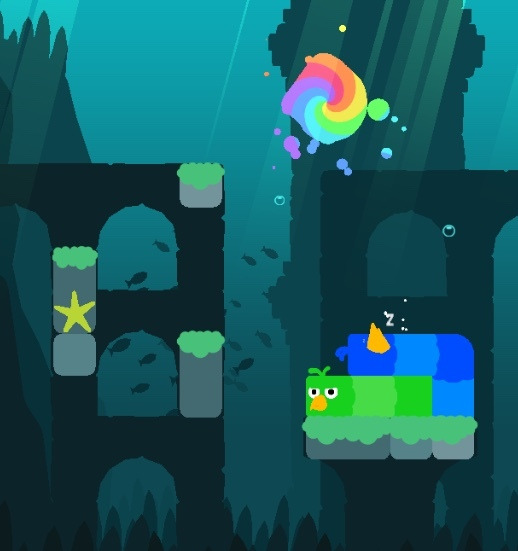

# String representation of a game state

The Snakebird field is rectangular and a game state is represented by a matrix of characters.
This matrix may be preceded by a line containing the height and width of the matrix, separated
by a space. It may be followed by a line containing the x and y coordinates of the target, seperated
by a space and followed by one of the strings `not over`, `won` or `lost` depending on whether
the game isn't over yet, was won or was lost. Additionally, the last line can contain the x and y
coordinates of the two portals (again, separated by spaces).

## Character table

| Character          | Meaning               | Character          | Meaning               |
| ------------------ | --------------------- | ------------------ | --------------------- |
| `X`                | target                | `$`                | target, game was won  |
| `?`                | target, game was lost | `@`                | fruit                 |
| `#`                | obstacle              | `|`                | spike                 |
| `*`                | portal                | `.`                | empty                 |
| `A` - `W`          | snake head            | `<`, `>`, `v`, `^` | snake body part       |
| `a` - `w`          | movable block         |                    |                       |

## Examples

From the 2017 ACM-ICPC Asia East Continent League Final:

```
9 11
.......X...
...........
....#......
...........
.#.........
.#.........
.#..#...B<<
....#..G<<^
.......####
```

